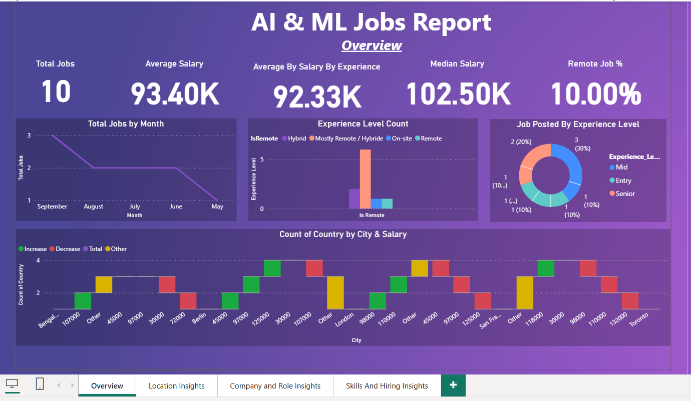
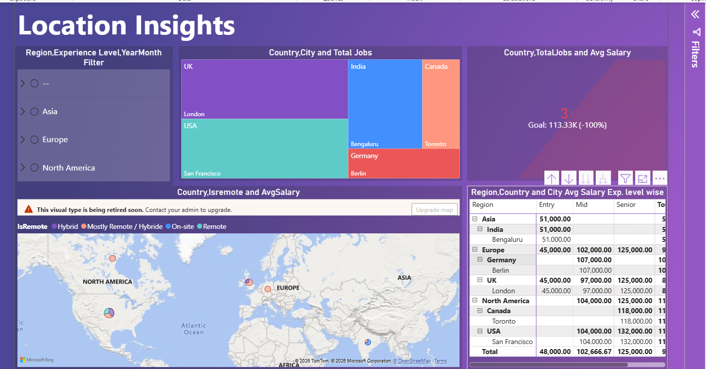
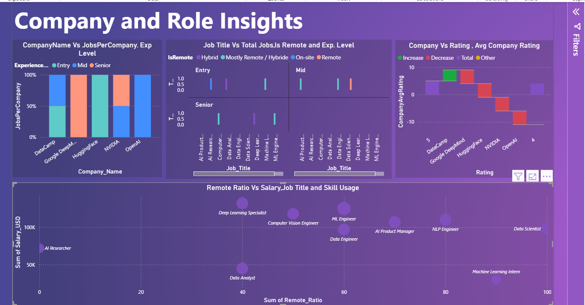
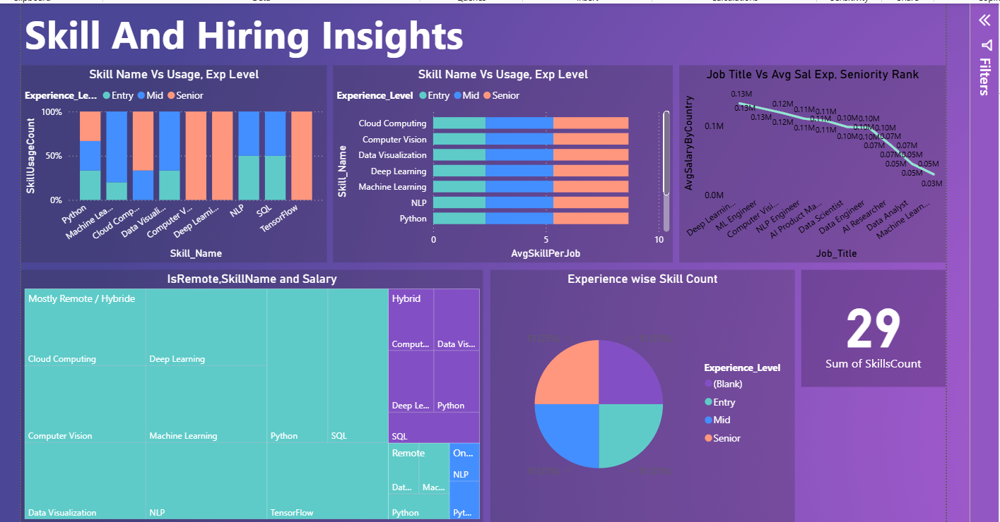

# 📊 Job Analysis Dashboard (Power BI)

A **Power BI Template (.pbit)** dashboard analyzing job postings data — covering companies, locations, skills, salaries, and hiring trends.

## 📁 File

- `Job_Analysis_Dashboard.pbit` — Power BI Template file. Open it with **Power BI Desktop**.

> A `.pbit` file contains the data model, DAX measures, Power Query (M) transformations, and report layout — but **no actual data**. When you open it, Power BI will prompt you to point it at the source CSV files (see [Data Sources](#-data-sources) below) before it loads.

## 🖥️ Dashboard Pages

### 1. Overview
High-level KPIs — Total Jobs, Average Salary, Median Salary, Remote Job %, jobs trend by month, experience-level breakdown, and job counts by city/salary.



### 2. Location Insights
Job distribution and average salary by region, country, and city, plus an interactive map view.



### 3. Company and Role Insights
Jobs per company by experience level, job titles by remote status, company ratings, and salary vs. remote ratio by role.



### 4. Skills And Hiring Insights
Most in-demand skills by usage and experience level, salary vs. job title by seniority rank, and experience-wise skill distribution.



## 🗄️ Data Model

| Table | Description | Key Columns |
|---|---|---|
| `Fact_Jobs` | Core fact table of job postings | Job_ID, Job_Title, Experience_Level, Employment_Type, Remote_Ratio, Salary_USD, Posted_Date, Company_ID, Location_ID |
| `Fact_Job_Skills` | Bridge table linking jobs to required skills | Job_ID, Skill_ID |
| `Dim_Companies` | Company details | Company_ID, Company_Name, Company_Size, Industry, Rating |
| `Dim_Locations` | Location details | Location_ID, City, Country, Region |
| `Dim_Skills` | Skill lookup | Skill_ID, Skill_Name |
| `Dim_Date` | Date dimension for time-intelligence | Date, Year, Quarter, MonthNum, MonthName, DayNum |

### Key Measures

- **Salary:** `AvgSalary`, `MedianSalary`, `AvgSalaryByCountry`, `AvgSalaryByExperience`, `AvgSalaryBySkill`
- **Volume:** `TotalJobs`, `JobsPerCompany`, `RemoteJobCount`, `RemoteJob%`
- **Trends:** `PrevMonthJob`, `JobsMOM%` (month-over-month change)
- **Company:** `CompanyAvgRating`
- **Skills:** `SkillUsageCount`, `AvgSkillPerJob`

## 📥 Data Sources

The template's Power Query steps expect the following CSV files (originally sourced from a local folder):

- `Companies.csv`
- `Jobs.csv`
- `Job_Skills.csv`
- `Locations.csv`
- `Skills.csv`

### Setup Instructions

1. Install **Power BI Desktop** (Windows only — free from Microsoft).
2. Place your `Companies.csv`, `Jobs.csv`, `Job_Skills.csv`, `Locations.csv`, and `Skills.csv` files in a folder of your choice.
3. Open `Job_Analysis_Dashboard.pbit` in Power BI Desktop.
4. When prompted (or via **Transform Data → Data Source Settings**), update each CSV source to point to your local file paths, since the template was originally built against absolute paths like:
   ```
   D:\Desktop\DATA SCIENCE\PowerBI\Job Analysis Dashboard Project 1\Jobs.csv
   ```
5. Click **Refresh** to load your data and the report will populate.

## 📌 Notes / Future Improvements

- Consider adding sample/demo CSVs to this repo (in a `/data` folder) so others can open the dashboard immediately without sourcing their own data.
- Consider parameterizing the file path in Power Query (using a Power BI **Parameter**) so users only need to update one value instead of five separate queries.
- Publish to Power BI Service and share a live report link for viewers who don't have Power BI Desktop.

## 📄 License

This project is open source and available for personal/educational use.
